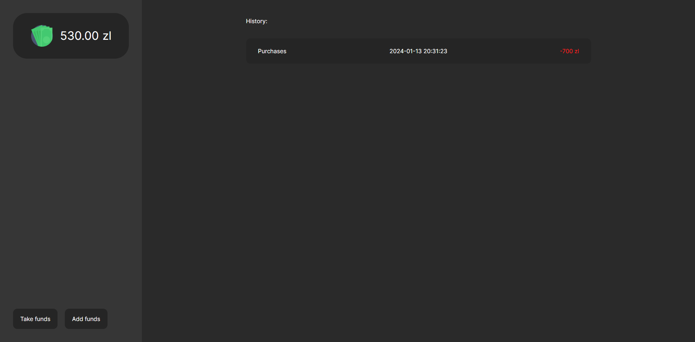

# Financial app

A simple application for recording expenses and income and calculating the total remaining amount


## Screenshots




## Installation

Install all dependencies

```bash
  npm install
```

Running in development mode

```bash
  npm run dev
```
Starting the build
```bash
  npm run build
```


## Example of creating SQL tables 

To store a list of expenses and replenishments
```sql
CREATE TABLE costs (
    id INT AUTO_INCREMENT PRIMARY KEY,
    title VARCHAR(255) CHARACTER SET utf8mb4 COLLATE utf8mb4_unicode_ci NOT NULL,
    value FLOAT NOT NULL,
    date_created TIMESTAMP DEFAULT CURRENT_TIMESTAMP
);

```

To record a budget
```sql
CREATE TABLE finance (
    id INT AUTO_INCREMENT PRIMARY KEY,
    budget DECIMAL(10, 2)
);

```


## 🔗 Links
[](https://shtefan.pl/)
[](https://www.linkedin.com/in/design-n-web-dev/)


